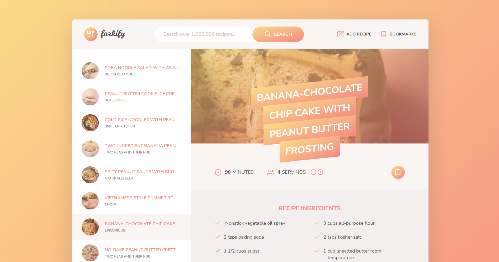

# Forkify Recipe App 

**Developer: Aleksandra Haniok**

💻 [Visit live website](https://forkifyfood-aleksandra.netlify.app)

### About

This is a recipe search engine made with modern JavaScript features, created by Aleksandra as part of [JavaScript course](https://www.udemy.com/course/the-complete-javascript-course/) (The Complete JavaScript Course: From Zero to Expert!) with Jonas Schmedtmann.

### Features

- Dynamic Search options for recipes using keywords
- View detailed recipe information, containing serrving size, ingredients and cooking instructions
- Save recipes to your favorites list for quick access
- Upload your own recipes
- Change serving sizes to automatically update ingredient quantities
- Intuitive user interface

### Technologies used

- HTML5
- SCSS/CSS3
- JavaScript

### Libraries and APIs

- [Forkify-API](https://forkify-api.herokuapp.com/v2)
- Parcel
- Fracty - to display user-friendly cooking format as fractions

### Architecture

Built using the MVC Architecture. View class extends the rest of the components. Controller keeps bidirectional dataflow. Model makes http requests.

### How to run

- `npm i`
- `npm start`
- `npm run build`

### Credits

Full credits to Jonas Schmedtmann for creating a professional Udemy course, knowledge sharing and providing great learning experience
